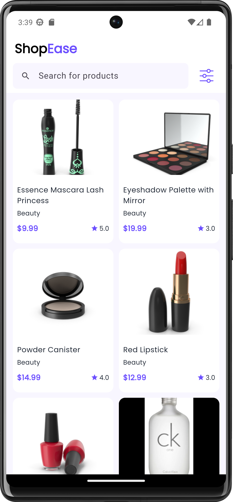
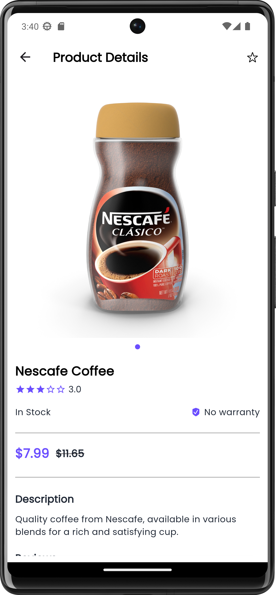
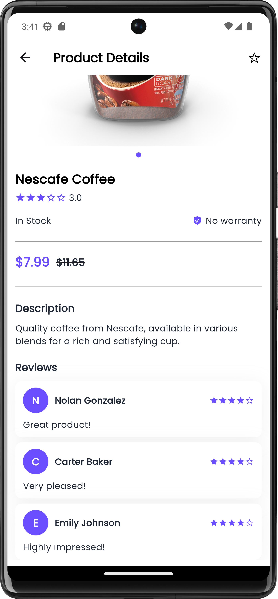

# Shopease - Ecommerce App

Shopease is a modern e-commerce app built with **Flutter**. The app is designed to provide a seamless and responsive shopping experience with features like search, filtering by category, and pagination for loading products.

## Screenshots

<div style="display: flex; gap: 10px;">
  
  
  
</div>

## Technologies Used

- **Flutter**: The cross-platform UI toolkit for building natively compiled applications for mobile.
- **Clean Architecture**: The app follows Clean Architecture principles for better separation of concerns, making it easier to scale and maintain.
- **GetX**: Used for state management and routing. GetX provides reactive programming and helps manage dependencies efficiently.
- **CachedNetworkImage**: Used for caching images and improving performance by loading images only once.
- **Dio**: Used for making HTTP requests. Dio is a powerful HTTP client that simplifies error handling and response parsing.
- **Connectivity**: Used for checking the internet connection status, providing feedback to the user when the app is offline.
- **Shimmer**: Used for adding loading effects. The shimmer effect provides a smooth loading experience while data is being fetched.

## Features

- **Search**: Allows users to search for products using keywords.
- **Filter by Category**: Users can filter products by their respective categories to find specific items faster.
- **Pagination**: Supports paginated data fetching to load products in chunks, reducing memory usage and improving performance.

## Folder Structure
    lib/
    ├── core/
    │   ├── bindings/           # Global bindings for GetX (dependency injection)
    │   ├── constants/          # Constant values used throughout the app
    │   ├── network/            # Network layer (Dio API calls, etc.)
    │   ├── shared/             # Shared components like widgets or services
    │   ├── theme/              # Theme and UI-related configurations (colors, text styles)
    │   └── utils/              # Utility classes (helpers, date formatters, etc.)
    ├── features/
    │   ├── home/               # Home feature module
    │   │   ├── data/           # Data layer (repositories, API models, local storage)
    │   │   ├── domain/         # Domain layer (use cases, business logic)
    │   │   └── presentation/   # Presentation layer (UI, GetX controllers, widgets)
    │   └── product/            # Another feature module (e.g., Product details)
    │       ├── data/           # Data layer
    │       ├── domain/         # Domain layer
    │       └── presentation/   # Presentation layer
    └─── main.dart               # Entry point

## Installation

### Prerequisites

- [Flutter SDK](https://flutter.dev/docs/get-started/install)
- A compatible IDE (Android Studio, VS Code, or IntelliJ IDEA)
- An emulator or a physical device for testing

### Getting Started

1. Clone the repository:
   ```bash
   git clone https://github.com/zsifat/shop_ease.git
   ```

2. Navigate to the project directory:
   ```bash
   cd shop_ease
   ```

3. Get Flutter dependencies:
   ```bash
   flutter pub get
   ```

4. Run the app:
   ```bash
   flutter run
   ```

## License

This project is licensed under the MIT License - see the [LICENSE](LICENSE) file for details.

## Contact

Zahidul Islam
Flutter Developer
Email: zahidulislamsifat1@gmail.com
LinkedIn: [Zahidul Islam](https://www.linkedin.com/in/zahidulislam1/)
GitHub: [@zsifat](https://github.com/zsifat)

Project Link: [https://github.com/zsifat/shop_ease](https://github.com/zsifat/shop_ease)

Feel free to reach out if you have any questions or suggestions about the project!


